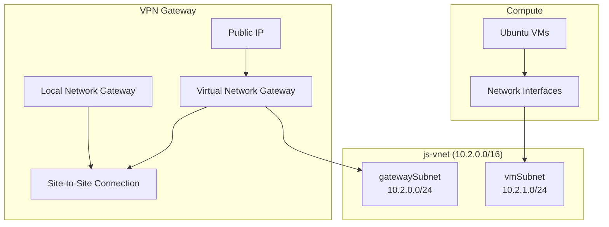

#test
# Azure Infrastructure (Bicep)

Infrastructure-as-code for an Azure environment with a virtual network, VPN gateway (site-to-site), and Linux VMs. Templates are written in [Bicep](https://learn.microsoft.com/azure/azure-resource-manager/bicep/overview) and organized into reusable modules.

## Architecture



| Component | Purpose |
|-----------|---------|
| **Virtual network** | `js-vnet` with dynamically declared subnets |
| **VPN gateway** | Route-based IPsec VPN to an on-premises/local endpoint (`10.10.0.0/16`) |
| **Virtual machines** | Ubuntu 26.04 LTS VMs on `vmSubnet`, sized via parameters |

## Repository layout

```
azure/
├── main.bicep              # Orchestrates network, compute, and gateway modules
├── main.bicepparam         # Required for deployment (not committed — see below)
└── modules/
    ├── rg.bicep            # Subscription-scoped: creates resource group
    ├── network.bicep       # VNet and subnets; exports subnet IDs
    ├── gateway.bicep       # VPN gateway, local gateway, and connection
    ├── compute.bicep       # NICs and VMs
    ├── gateway.bicepparam  # Standalone gateway deployment params
    └── compute.bicepparam  # Standalone compute deployment params
```

## Modules

### `network.bicep`

Creates `js-vnet` (`10.2.0.0/16`) and subnets from the `subnets` parameter (default: `['gateway', 'vm']`). Subnet names follow `{name}Subnet` (e.g. `gatewaySubnet`, `vmSubnet`). Address prefixes are assigned as `10.2.{index}.0/24` based on position in the array.

**Outputs:**

| Output | Type | Description |
|--------|------|-------------|
| `subnetInfo` | `array` | `{ name, subnetID }` per subnet |
| `subnetIds` | `object` | Name-keyed map for lookup without array indexes |

Example consumer lookup:

```bicep
module vnet './network.bicep' = { name: 'network' }

var gatewaySubnetId = vnet.outputs.subnetIds.gatewaySubnet
var vmSubnetId = vnet.outputs.subnetIds.vmSubnet
```

`subnetIds` is built with `toObject()` inside the network module so callers can reference subnets by name. Filtering module output arrays in a parent `var` with a `for`-expression is not supported (BCP178).

To add a subnet, append to the `subnets` array in `network.bicep`; a new entry appears in both outputs automatically.

### `gateway.bicep`

Deploys:

- Standard public IP for the gateway
- Virtual network gateway (Basic SKU, route-based VPN) on `gatewaySubnet`
- Local network gateway (peer `10.10.0.0/16`, fixed public IP in template)
- Site-to-site IPsec connection (`udmS2Sconnection`)

Embeds the network module and resolves the gateway subnet via `vnet.outputs.subnetIds.gatewaySubnet`.

### `compute.bicep`

Deploys a configurable count of VMs (`vmCount`) with matching NICs on `vmSubnet`. Default image: Canonical Ubuntu 26.04 LTS (`server` SKU). Also embeds the network module for standalone use.

### `rg.bicep`

Subscription-scoped template that creates the `iac-infra-rg` resource group. Deploy this first if the target group does not exist.

## Prerequisites

- [Azure CLI](https://learn.microsoft.com/cli/azure/install-azure-cli) with Bicep support (`az bicep install`)
- An Azure subscription and rights to deploy networking, compute, and Key Vault–backed secrets
- A Key Vault with the secrets listed below (see [Required parameters file](#required-parameters-file))

## Required parameters file

Full-stack deployment **requires** a `main.bicepparam` file in the repository root. This file is **gitignored** (see `.gitignore`) so subscription IDs, vault names, and secret references are never committed. Create `main.bicepparam` locally before your first deploy.

`main.bicep` defines no default values — every parameter below must be supplied in `main.bicepparam`.

### Required parameters

| Parameter | Type | Required | Description |
|-----------|------|----------|-------------|
| `location` | `string` | Yes | Azure region for all resources (e.g. `eastus`) |
| `vmCount` | `int` | Yes | Number of virtual machines to deploy |
| `prefix` | `string` | Yes | Name prefix for VMs, NICs, and disks |
| `adminName` | `string` | Yes | Local admin username on each VM |
| `vmHWType` | `string` | Yes | Azure VM size (e.g. `Standard_B1ls`) |
| `vmPW` | `string` (secure) | Yes | VM admin password — load from Key Vault |
| `gwSharedKey` | `string` (secure) | Yes | IPsec shared key for the VPN connection — load from Key Vault |

### Key Vault secrets

Store these secrets in your vault before deploying. Names must match the last argument of each `az.getSecret()` call.

| Key Vault secret name | Parameter | Used for |
|-----------------------|-----------|----------|
| `vm-pw` | `vmPW` | VM admin password |
| `gw-shared-key` | `gwSharedKey` | VPN site-to-site IPsec pre-shared key |

`az.getSecret()` arguments: **subscription ID**, **resource group containing the vault**, **vault name**, **secret name**.

### Example `main.bicepparam` (sanitized)

Copy this to `main.bicepparam` and replace the placeholder values with your environment:

```bicep
using './main.bicep'

param location = 'eastus'
param vmCount = 3
param prefix = 'myapp'
param adminName = 'azureadmin'
param vmHWType = 'Standard_B1ls'

// VM admin password — secret must exist in Key Vault as 'vm-pw'
param vmPW = az.getSecret(
  '00000000-0000-0000-0000-000000000000',
  'my-secrets-rg',
  'my-key-vault',
  'vm-pw'
)

// VPN IPsec shared key — secret must exist in Key Vault as 'gw-shared-key'
param gwSharedKey = az.getSecret(
  '00000000-0000-0000-0000-000000000000',
  'my-secrets-rg',
  'my-key-vault',
  'gw-shared-key'
)
```

| Placeholder | Replace with |
|-------------|--------------|
| `00000000-0000-0000-0000-000000000000` | Your Azure subscription ID |
| `my-secrets-rg` | Resource group that contains the Key Vault |
| `my-key-vault` | Key Vault name |
| `vm-pw` / `gw-shared-key` | Secret names in the vault (or change to match your naming) |

Deploying with `main.bicepparam` requires Key Vault access at deployment time (e.g. RBAC **Key Vault Secrets User** on the vault, or equivalent legacy access policy).

## Deployment

### 1. Create the resource group (if needed)

```bash
az deployment sub create \
  --location eastus \
  --template-file modules/rg.bicep
```

### 2. Full stack (recommended entry point)

1. Create `main.bicepparam` from the [sanitized example](#example-mainbicepparam-sanitized) (required; not in git).
2. Ensure Key Vault secrets `vm-pw` and `gw-shared-key` exist.
3. Deploy:

```bash
az deployment group create \
  --resource-group iac-infra-rg \
  --template-file main.bicep \
  --parameters main.bicepparam
```

The `--parameters main.bicepparam` argument is required for full-stack deployment; `main.bicep` cannot be deployed without it.

`compute` and `gateway` modules declare `dependsOn: [ vnet ]` so the root network module completes first.

> **Note:** `compute.bicep` and `gateway.bicep` each include their own `network.bicep` module for standalone deployments. When invoked from `main.bicep`, they still nest a network module internally. For a single shared VNet in production, pass `subnetIds` from the root `vnet` module into compute/gateway and remove the nested network modules.

### 3. Deploy individual modules

Useful for testing or partial updates. Target resource group `iac-infra-rg`:

```bash
# Network only
az deployment group create \
  --resource-group iac-infra-rg \
  --template-file modules/network.bicep

# Gateway only (requires existing VNet/subnets or accepts nested network deploy)
az deployment group create \
  --resource-group iac-infra-rg \
  --template-file modules/gateway.bicep \
  --parameters modules/gateway.bicepparam

# Compute only
az deployment group create \
  --resource-group iac-infra-rg \
  --template-file modules/compute.bicep \
  --parameters modules/compute.bicepparam
```

### Validate templates locally

```bash
az bicep build --file main.bicep
az bicep build --file modules/network.bicep
az bicep build --file modules/gateway.bicep
az bicep build --file modules/compute.bicep
```

## What gets created (default)

| Resource | Name / pattern |
|----------|----------------|
| Virtual network | `js-vnet` |
| Subnets | `gatewaySubnet`, `vmSubnet` |
| Public IP | `js-gw-pip{uniqueString}` |
| VPN gateway | `js-vpn-gw` |
| Local network gateway | `js-localgw-{uniqueString}` |
| Connection | `udmS2Sconnection` |
| NICs | `{prefix}-nic-0{n}` |
| VMs | `{prefix}-vm-0{n}` |

## Customization

- **Subnets:** Edit the `subnets` array in `modules/network.bicep` and reference new keys on `subnetIds` in other modules (e.g. `subnetIds.dbSubnet`).
- **VPN peer:** Update `localNetworkGateway` properties in `modules/gateway.bicep` (address space, `gatewayIpAddress`).
- **VM image/size:** Adjust `storageProfile.imageReference` and `vmHWType` in compute templates/params.
- **Region:** Set `location` in your local `main.bicepparam` and ensure child modules use the same region consistently.

## Related documentation

- [Bicep modules](https://learn.microsoft.com/azure/azure-resource-manager/bicep/modules)
- [Bicep parameters files](https://learn.microsoft.com/azure/azure-resource-manager/bicep/parameter-files)
- [Use Key Vault secrets in parameter files](https://learn.microsoft.com/azure/azure-resource-manager/bicep/key-vault-parameter)
- [Azure VPN Gateway](https://learn.microsoft.com/azure/vpn-gateway/vpn-gateway-about-vpngateways)
